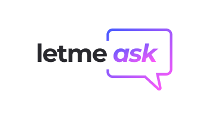
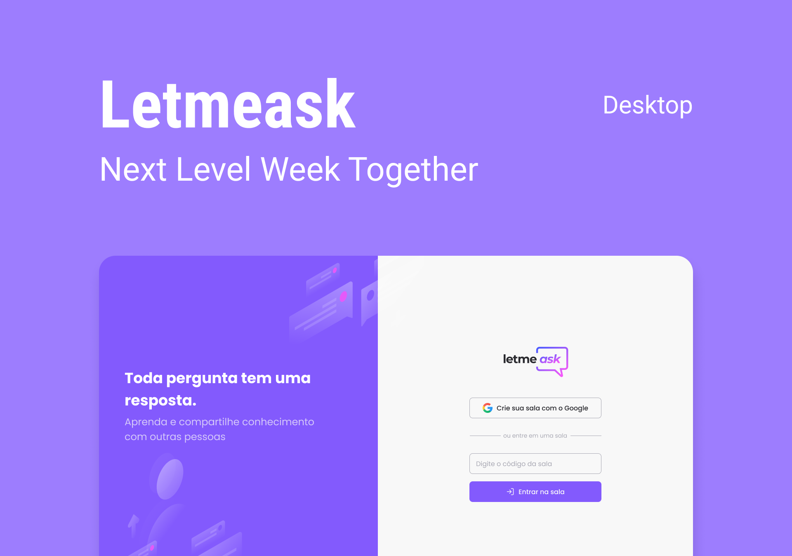
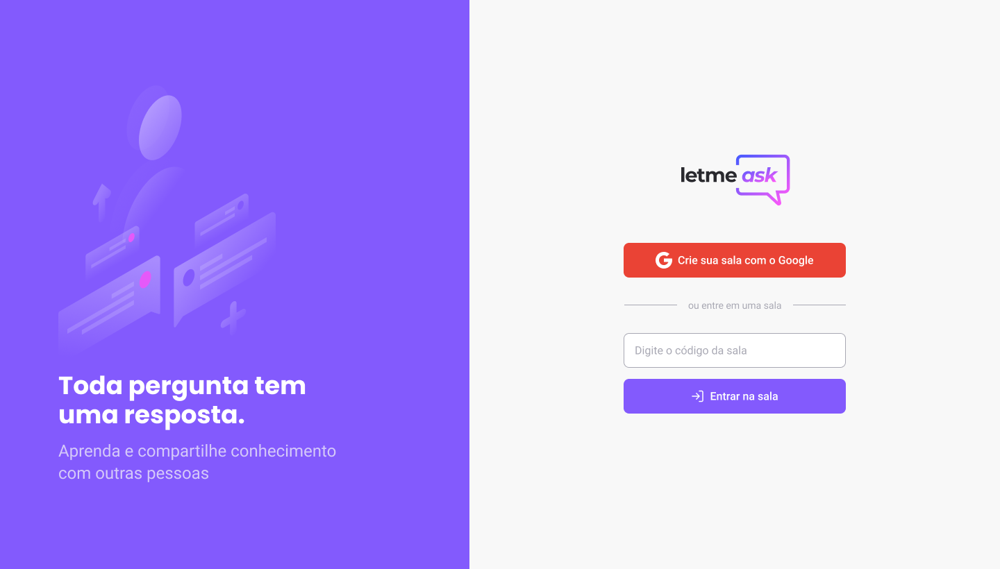

<div align="center">
   
   <h3>Toda pergunta tem uma resposta.</h3>
</div>
<br/>
<div align="center">
   <a href="https://github.com/mathrb22">
      
   </a>

   

   

   <a aria-label="React Version" href="https://github.com/facebook/react/blob/master/CHANGELOG.md#1702-march-22-2021">
      </img>
   </a>

   <a href="https://github.com/mathrb22/letmeask/commits/main">
      
   </a>

   <a href="https://github.com/mathrb22/letmeask/issues">
      
   </a>

   <a href="https://github.com/mathrb22/letmeask/pulls">
      
   </a>

   <a href="https://github.com/mathrb22/letmeask/blob/main/LICENSE">
      
   </a>
   </br>
   </br>
   <a href="#-tecnologias-utilizadas">
      
      
      
      
   </a>
</div>

</br>
<div align="center">

[**Sobre**](#-sobre) &nbsp;&nbsp;**|**&nbsp;&nbsp;
[**Tecnologias e ferramentas utilizadas**](#-tecnologias-e-ferramentas-utilizadas) &nbsp;&nbsp;**|**&nbsp;&nbsp;
[**Layout**](#-layout) &nbsp;&nbsp;**|**&nbsp;&nbsp;
[**Instalação e execução**](#-instalação-e-execução) &nbsp;&nbsp;**|**&nbsp;&nbsp;
[**Como contribuir**](#-como-contribuir) &nbsp;&nbsp;**|**&nbsp;&nbsp;
[**Contato**](#-contato) &nbsp;&nbsp;**|**&nbsp;&nbsp;
[**Licença**](#-licença)

</div>

## 📃 Sobre

<div align="center">
  
</div>
<br/>

**Letmeask** é o projeto desenvolvido durante a trilha de React da sexta edição da **Next Level Week Together**, um evento online produzido pela [**Rocketseat**](https://github.com/Rocketseat).

Trata-se de uma **plataforma que permite que os usuários façam perguntas a outros usuários em tempo real**, e votem nas perguntas mais interessantes para que o host (apresentador ou palestrante) responda a pergunta solicitada. O Letmeask terá a visualização no **modo admin**, para o criador da sala gerenciar as perguntas e respostas, e o **modo do participante** que poderá enviar sua pergunta no fórum.

## 🚀 Tecnologias e ferramentas utilizadas

Este projeto foi desenvolvido com as seguintes tecnologias e ferramentas:

- [**React**](https://reactjs.org/): uma biblioteca JavaScript de código aberto com foco em criar interfaces de usuário (frontend) em páginas web. É mantido pelo Facebook, Instagram, outras empresas e uma comunidade de desenvolvedores individuais. É utilizado nos sites da Netflix, Imgur, Feedly, Airbnb, SeatGeek, HelloSign, Walmart e outros;

- [**Firebase**](https://firebase.google.com/): um BaaS (Backend As A Service) pertencente à Google que oferece várias ferramentas para o desenvolvimento de uma aplicação, seja ela web ou móvel.

- [**TypeScript**](https://www.typescriptlang.org/): um super conjunto da linguagem JavaScript que fornece classes, interfaces e tipagem estática opcional.

- [**Sass**](https://sass-lang.com/): um pré-processador CSS que estende a sintaxe do CSS convencional, nos dando um controle mais profissional e dinâmico às folhas de estilo (stylesheets);

- [**Git**](https://git-scm.com/downloads): o sistema de controle de versão distribuído de código aberto mais utilizado;

- [**Visual Studio Code**](https://code.visualstudio.com/): um editor de código-fonte desenvolvido pela Microsoft para Windows, Linux e macOS, recomendado para o desenvolvimento de aplicações web;

## 📟 Layout

O layout das telas da aplicação **Letmeask** foi desenvolvido pela equipe da **Rocketseat** através da ferramenta online [**Figma**](https://www.figma.com), um software de prototipação voltado para **UI Design (design de interfaces de usuário)**.
Você pode acessar o layout através deste link: [**Letmeask**](https://www.figma.com/file/u0BQK8rCf2KgzcukdRRCWh/Letmeask/duplicate).

<figure>
<div align="center">
  
</div>
</figure>

## 🔧 Instalação e execução

Para baixar o código-fonte do projeto em sua máquina, primeiramente terá que ter instalado o [**Git**](https://git-scm.com/).

Com o Git instalado, em seu terminal execute o seguinte comando:

```bash
git clone https://github.com/mathrb22/letmeask.git
```

Para instalar as dependências e executar o projeto terá que ter instalado em sua máquina o [**Node.js**](https://nodejs.org/en/), que vem acompanhado do NPM. Com ele instalado:

Instale as dependências do projeto:

```bash
npm install
```

Execute o projeto:

```bash
npm start
```

## 💡 Como contribuir

- Faça um **_fork_** desse repositório;
- Crie um **branch** para a sua feature: `git checkout -b minha-feature`;
- Faça um **commit** com suas alterações: `git commit -m 'feat: Minha nova feature'`;
- Faça um **push** para o seu branch: `git push origin minha-feature`;
- Faça um **pull request** com sua feature;

Pull requests são sempre bem-vindos. Em caso de dúvidas ou sugestões, crie uma _**issue**_ ou entre em contato comigo.

## 📲 Contato

Entre em contato comigo por e-mail ou pelo meu LinkedIn:

<a href="mailto:math.ribeiro.dev@gmail.com"></a>
<a href="https://www.linkedin.com/in/matheus-ribeiro-dev/"></a>

## 📝 Licença

<a href="https://github.com/mathrb22/letmeask/blob/main/LICENSE">
    
</a>

Esse projeto está sob a licença **MIT**. Veja o arquivo _**LICENSE**_ para mais detalhes.

---

<h5 align="center">
  &copy;2021 - <a href="https://github.com/mathrb22/">Matheus Ribeiro</a>
</h5>
